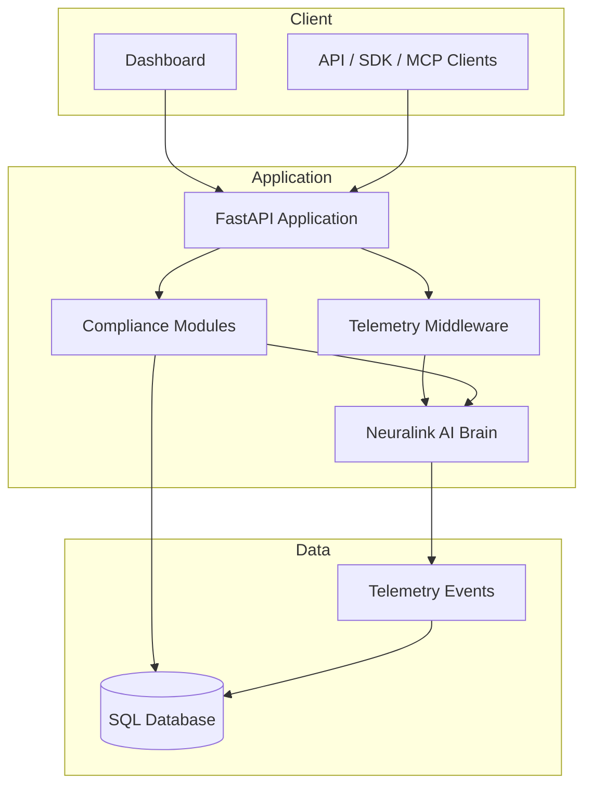
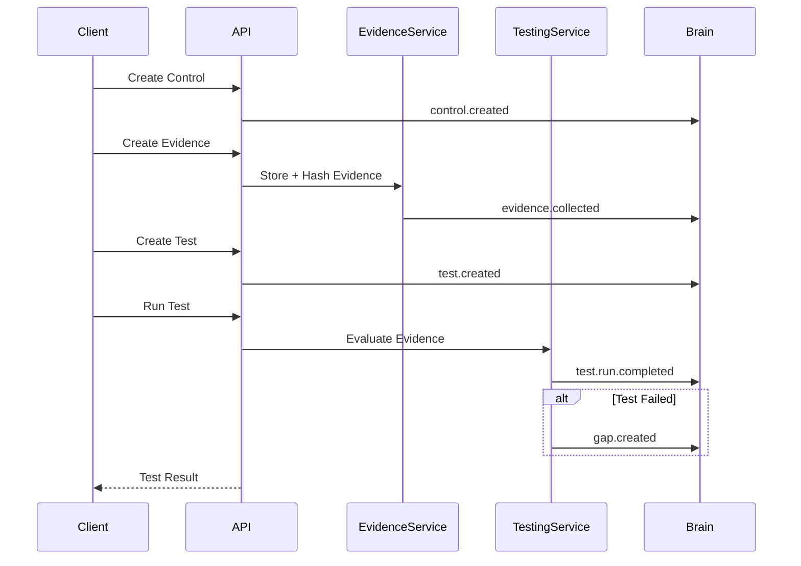
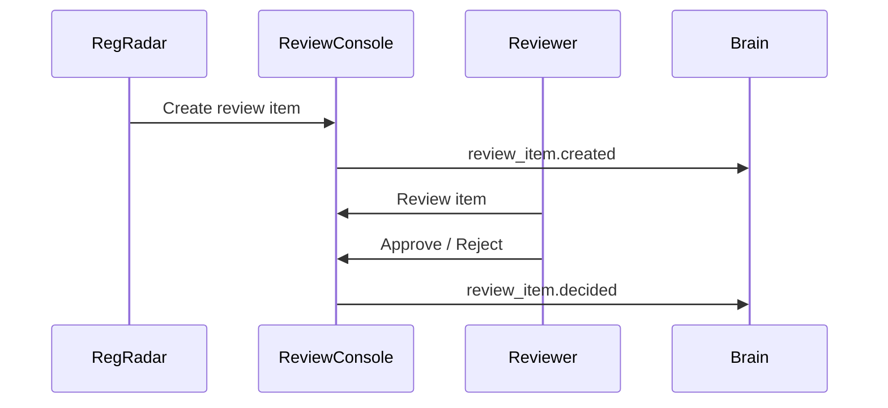
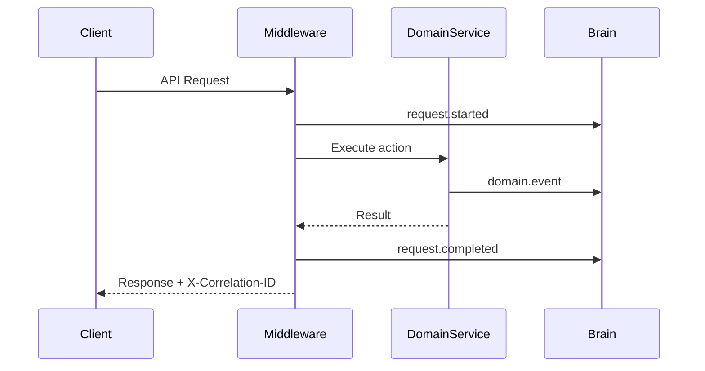

# ComplianceOS — Compliance Neuralink AI Brain

A deployable compliance operating system starter with a central **Neuralink AI Brain** for tracking, monitoring, correlation, and flow observability.

This repository provides a runnable MVP for:

- multi-tenant compliance objects,
- control catalog,
- evidence collection,
- evidence hashing,
- evidence quality scoring,
- control tests,
- gap creation,
- expert review console,
- telemetry event tracking,
- flow correlation by correlation ID,
- monitoring dashboard.

---

## Architecture



---

## Core Flows

### Evidence to Control Test Flow



### Expert Review Flow



### Neuralink Brain Correlation Flow



---

## Project Structure

```text
ComplianceOS/
├── app/
│   └── main.py
├── scripts/
│   ├── init_postgres_rls.sql
│   └── load_test_k6.js
├── Dockerfile
├── docker-compose.yml
├── requirements.txt
└── README.md
```

---

## Local Setup

### 1. Create virtual environment

```bash
python -m venv .venv
source .venv/bin/activate
```

### 2. Install dependencies

```bash
pip install -r requirements.txt
```

### 3. Run API

```bash
uvicorn app.main:app --reload
```

### 4. Open dashboard

```text
http://localhost:8000
```

### 5. Seed demo data

Click **Seed Demo Data** in the dashboard, or run:

```bash
curl -X POST http://localhost:8000/v1/seed/demo
```

---

## Docker Deployment

Build and run:

```bash
docker compose up --build
```

Open:

```text
http://localhost:8000
```

---

## API Endpoints

### Health

```text
GET /health
GET /v1/brain/health
```

### Tenants

```text
POST /v1/tenants
GET  /v1/tenants
```

### Controls

```text
POST /v1/controls
GET  /v1/controls
```

### Evidence

```text
POST /v1/evidence
GET  /v1/evidence
```

### Tests

```text
POST /v1/tests
GET  /v1/tests
POST /v1/tests/{test_id}/run
```

### Gaps

```text
GET /v1/gaps
```

### Expert Review Console

```text
POST /v1/review-console/items
GET  /v1/review-console/items
POST /v1/review-console/items/{item_id}/decision
```

### Neuralink Brain

```text
GET /v1/brain/events
GET /v1/brain/flows/{correlation_id}
GET /v1/brain/metrics
```

---

## Monitoring Dashboard

The dashboard shows:

- tenant count,
- control count,
- evidence count,
- tests count,
- test runs,
- gaps,
- review items,
- telemetry events,
- event counts by flow,
- event counts by status.

---

## Production Checklist

Before production deployment, add:

1. Authentication and authorization.
2. OAuth2 / OIDC with scope enforcement.
3. PostgreSQL with row-level security.
4. Secrets manager.
5. HTTPS/TLS.
6. Rate limiting.
7. Audit log immutability.
8. Object storage for raw evidence.
9. Background workers for connectors.
10. AI gateway with prompt logging.
11. Vector database for answer-library retrieval.
12. Webhook delivery retry and DLQ.
13. OpenTelemetry integration.
14. Backup and disaster recovery.
15. Load testing and chaos testing.

---

## Notes

This is a deployable starter system.

For a full enterprise platform, expand each module into dedicated services:

- Control Service,
- Evidence Service,
- Testing Service,
- Policy Service,
- Questionnaire Service,
- Auditor Service,
- Trust Center Service,
- Privacy Service,
- Vendor Risk Service,
- Regulatory Radar Service,
- Incident Service,
- Reporting Service,
- Neuralink Brain Service.
